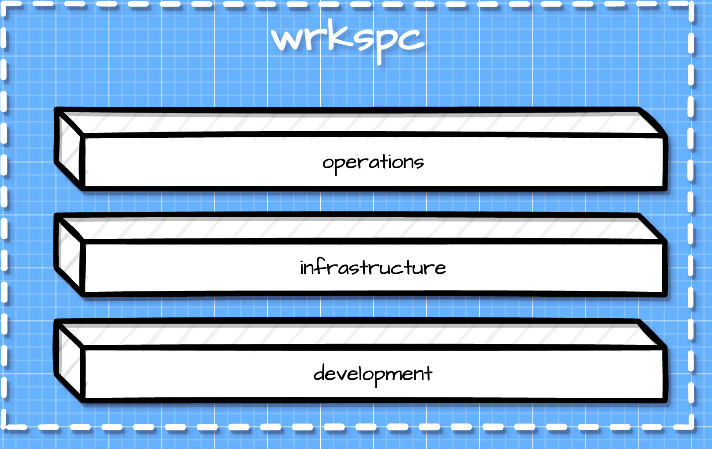

# wrkspc

Workspace is an end-to-end platform that covers everything from development to production to day two operations.

The general concept is that it builds on container and clustering technology by using Docker and Kubernetes as packages (libraries) integrated in the code itself.

This makes it such that there is truly no difference between your development environment and any other stage in the life-cycle of the project.

It includes a custom shell and editor, which both run in containers, running in pods, deployed on a cluster that is automatically deployed on your local machine, or running remotely depending on your configuration.

The cluster that wrkspc builds is git aware, and is deployed with a full CI/CD pipeline, so you can even use the editor to directly hotfix production without any extra steps needed to manage the new code. It integrates directly back into your repository.

## Overview

Below is a brief overview of the included packages. Please look in each sub directory for more detailed documentation.

### amsh

Ape Machine Shell is a wrapper around a zshell instance running in a container on the cluster that you are connected to.

### apeterm

Provides a terminal raw interface needed for the built-in editor so we can use ansi codes to move around freely vs the standard cooked mode.

### berrt

Companion to errnie, together making up an advanced and dynamic error, tracing, and logging package.

### brazil

Conveniance methods to perform filesystem operations.

### cmd

The classic Go CLI package, providing sub commands and command line flags.

### datura

Data lake operations using S3 compatible object storage.

### docs

Automatically generated CLI documentation.

### eddie

A custom editor much like Vim or Emacs, but not Vim and/or Emacs.

### errnie

Custom error handling, logging, and tracing.

### kube

Kubernetes as a package/library. Able to deploy a KIND (Kubernetes in Docker) cluster if there is no kubeconfig file available to connect to a remote cluster.

### spd

Secure Private Datagrams, a custom data type designed fpr cloud native workflows and to enable a single endpoint API that provides infinite endpoints.

### tui

Terminal User Interface, basically pretty stuff for printing to the terminal.

### twoface

Custom concurrency primitives to improve developer ergonomics.
