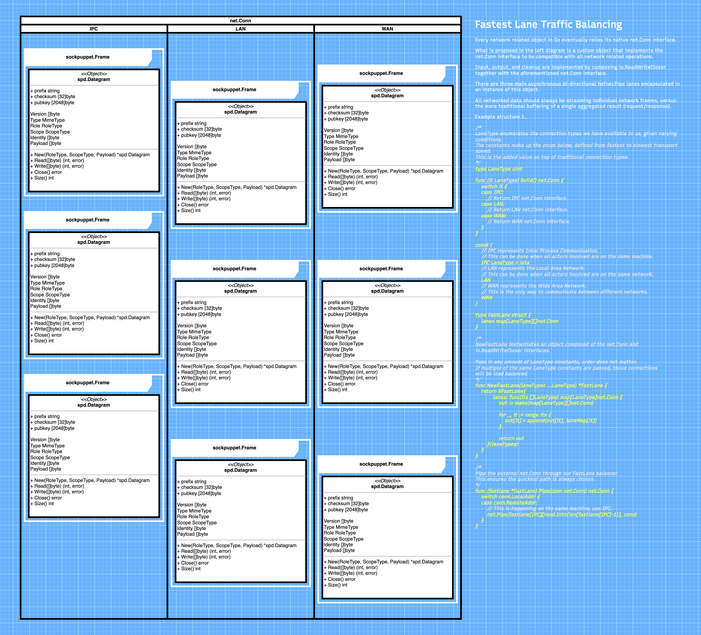

# hefner

A package which provides a communication pipe between objects, transparently figuring out the
most optimized path across distributed architectures.

## Pipe

The main object provided by the `hefner` package, responsible for chaining together objects.
